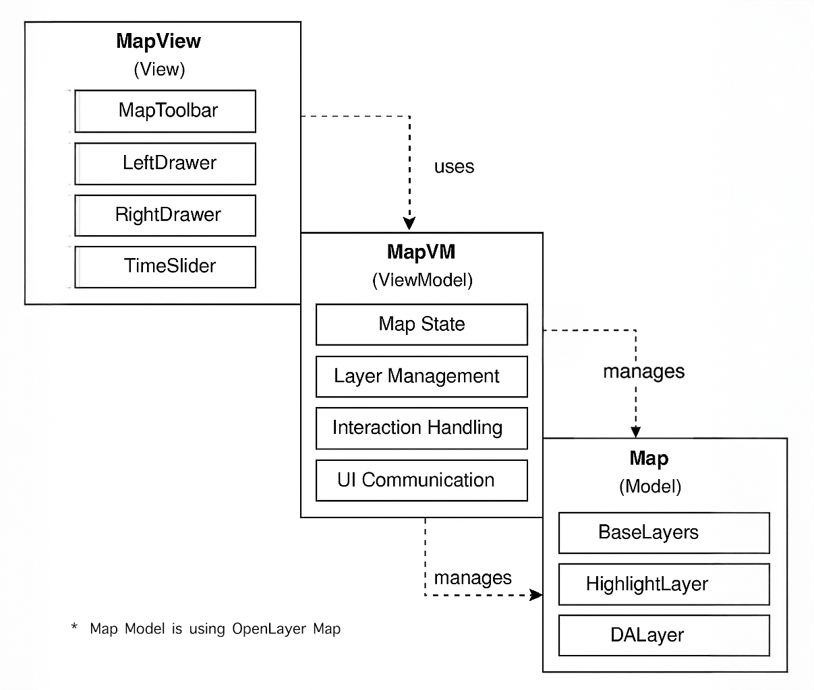

# DAMapUI

> Vite-based React UI for Digital Arz Maps. Built on top of OpenLayers and fully integrated with DigitalArzNode for map
> visualization, analysis, and interaction.

---

## 🚀 Getting Started

### 1. Installation

```bash
npm install damap
```

For peer dependencies, install:

```bash
npm install \
@emotion/react@^11.0.0 \
@emotion/styled@^11.0.0 \
@mui/material@^7.0.0 \
ol@^10.5.0 \
ol-ext@^4.0.31
```

### 2. Environment Variables

Create a `.env` file in the root of your project with one of the following configurations:

#### ✅ Option 1: Using Full Backend URL

```env
VITE_MAP_URL=https://yourdomain.com/api
VITE_MAP_PORT=         # leave empty
VITE_BING_MAPS_KEY=*********************************
VITE_APP_NAME=DAMap #or your App Name
```

Use this when your backend is hosted at a full domain URL (e.g., production on whhdrm.club).

#### ✅ Option 2: Using Local Network or IP with Port and Endpoint

```env
VITE_MAP_URL=          # leave empty
VITE_MAP_PORT=8778
VITE_BING_MAPS_KEY=*********************************
VITE_APP_NAME=DAMap #or your App Name
```

Use this in a **local/WAN setup** where only the port is known.

---

## DAMap Architecture Model

DAMap follows the MVVM (Model–View–ViewModel) design pattern:

* **View**: React components like `MapView`, `LeftDrawer`, `RightDrawer`, `TimeSlider`.
* **ViewModel**: The `MapVM` class managing state, logic, and interactions.
* **Model**: OpenLayers `Map` and layers like `BaseLayers`, `HighlightLayer`, `DALayer`.



---

## 🧱 Folder Structure

```bash
damap-ui/
├── public/                      # Static assets
├── src/
│   ├── api/                     # API abstraction
│   ├── assets/                  # Images/icons/logos
│   ├── components/
│   │   ├── admin/               # Admin-specific
│   │   ├── auth/                # Authentication
│   │   ├── base/                # UI base components
│   │   ├── map/                 # Map modules
│   │   └── styled/              # Styled MUI components
│   ├── hooks/                   # Custom hooks
│   ├── layouts/                 # Layout wrappers
│   ├── pages/                   # Main pages
│   ├── routes/                  # App routing
│   ├── services/                # External APIs
│   ├── store/                   # Redux store & slices
│   ├── types/                   # TypeScript types
│   ├── utils/                   # Utilities
│   ├── App.tsx
│   └── index.tsx
├── .env
├── package.json
├── tsconfig.json
├── vite.config.ts
└── README.md
```

---

## 🗺️ Map View and ViewModel

### 🧱 Embed MapView Component

```tsx
import {MapView} from "damap";
import {AppBar, Button, Toolbar} from "@mui/material";
import 'damap/damap.css'

const mapRef = useRef();
const mapUUID = "your-map-uuid";

<MapView ref={mapRef} uuid={mapUUID} isMap={true}>
    <AppBar position="static" color="primary">
        <Toolbar variant="dense">
            <Button variant="contained">Custom Toolbar Button</Button>
        </Toolbar>
    </AppBar>
</MapView>
```

### 🧠 Use ViewModel Functions

```tsx
import {useMapVM} from "damap";

const mapVM = useMapVM();
mapVM.addDALayer({uuid: selectedOption});
mapVM.zoomToFullExtent();
```

---

## 🧰 Map Toolbar System

The `MapToolbarContainer` is the central component for rendering OpenLayers-based toolbar buttons. It uses React
Context (`MapVMInjectProvider`) to inject the `MapVM` instance into all child components, allowing your buttons to
access the map without prop-drilling.

---

### ✅ Basic Usage

You can render it inside your app like this:

```tsx
import {MapToolbarContainer} from 'damap';

<MapToolbarContainer mapVM={mapVM}/>
```

Or attach it dynamically to a DOM element:

```tsx
import {createRoot} from 'react-dom/client';
import {MapToolbarContainer} from 'damap';

const root = createRoot(domElement);
root.render(<MapToolbarContainer mapVM={mapVM} dynamicButtons={[<MyButton/>]}/>);
```

---

### 🔧 Built-in Toolbar Buttons (Auto-included)

| Component               | Description                               |
|-------------------------|-------------------------------------------|
| `LayerSwitcherControl`  | Toggle visibility of map layers           |
| `Zoom2Extent`           | Zoom to the full extent of the map        |
| `RefreshMap`            | Reload all visible DALayers               |
| `ClearSelection`        | Clear selected/highlighted features       |
| `Identifier`            | Identify and inspect clicked map features |
| `AttributeTableControl` | Opens a drawer with tabular view          |
| `LOISelector`           | Choose Layer of Interest (LOI)            |

These buttons are included by default when using `MapToolbarContainer`.

---

### ➕ Dynamic Buttons via `dynamicButtons`

You can pass your custom buttons using the `dynamicButtons` prop:

```tsx
<MapToolbarContainer mapVM={mapVM} dynamicButtons={[<MyCustomButton/>]}/>
```

Example of a custom button using `useMapVM`:

```tsx
import {IconButton, Tooltip} from "@mui/material";
import BuildIcon from '@mui/icons-material/Build';
import {useMapVM} from 'damap';

const MyCustomButton = () => {
    const mapVM = useMapVM();
    return (
        <Tooltip title="Zoom to Extent">
            <IconButton onClick={() => mapVM.zoomToFullExtent()}>
                <BuildIcon/>
            </IconButton>
        </Tooltip>
    );
};
```

---

### 🧠 Runtime Injection (via `getMapVM().getMapToolbar()`)

If you prefer to inject a toolbar button at runtime after the map has loaded:

```tsx
import {useEffect, useRef} from "react";
import {IconButton, Tooltip} from "@mui/material";
import BuildIcon from '@mui/icons-material/Build';
import {getMapVM} from "damap";

const buttonAdded = useRef(false);

useEffect(() => {
    const mapVM = getMapVM();
    if (!buttonAdded.current && mapVM?.getMapToolbar) {
        mapVM.getMapToolbar().addButton(
            <Tooltip title="Custom Tool">
                <IconButton onClick={() => alert("Custom action executed!")}>
                    <BuildIcon/>
                </IconButton>
            </Tooltip>
        );
        buttonAdded.current = true;
    }
}, []);
```

---

### 📦 Optional / On-Demand Buttons

These buttons are available but not included by default in the toolbar. You can inject them via `dynamicButtons` or
include them manually. Some of them are only available for authorized users:

```tsx
import {
    AddLayer,
    // SaveMap,                 // 🔐 Admin-only
    // SymbologyControl,        // 🔐 Admin-only
    // RasterArea,
    // AddClassificationSurface,
    // CommentButton
} from 'damap';
```

| Optional Button            | Description                             |
|----------------------------|-----------------------------------------|
| `AddLayer`                 | Add new DALayer dynamically             |
| `CommentButton`            | View/Submit comments on layers/features |
| `SaveMap` 🔐               | Save current map config (admin only)    |
| `SymbologyControl` 🔐      | Open symbology editor for map layers    |
| `RasterArea`               | Draw polygon for raster zonal stats     |
| `AddClassificationSurface` | Add LULC, NDVI, or AI-generated layers  |

> **Note**: You can expose admin-only buttons via a separate file like `adminExports.ts` if needed.

---

### 🛠 Accessing `MapVM` in Your Buttons

Use `useMapVM()` from `"damap"` to access the map controller inside any custom toolbar button.

```tsx
import {useMapVM} from 'damap';
import {IconButton, Tooltip} from "@mui/material";
import BuildIcon from "@mui/icons-material/Build";

const MyCustomButton = () => {
    const mapVM = useMapVM();
    return (
        <Tooltip title="Custom Action">
            <IconButton onClick={() => mapVM.zoomToFullExtent()}>
                <BuildIcon/>
            </IconButton>
        </Tooltip>
    );
};
```

## 🕒 Time Slider Usage

The `TimeSlider` component allows users to visualize and select temporal data over a range of dates for layers that support time-based filtering.

---

### 🧱 Step 1: Create a Ref

```tsx
import { useRef } from 'react';
import { TimeSliderHandle } from 'damap';

const timeSliderRef = useRef<TimeSliderHandle>(null!);
```

---

### 📦 Step 2: Add the TimeSlider Component

```tsx
import { TimeSlider } from 'damap';

<TimeSlider
  ref={timeSliderRef}
  mapVM={mapVM}
  onDateChange={(date: Date) => {
    console.log("User selected:", date);
  }}
/>
```

The `onDateChange` is optional. If omitted, the selected layer will automatically update using `updateTemporalData(date)`.

---

### 🗓️ Step 3: Set Date Range (Optional)

You can manually set a custom date range if needed:

```ts
timeSliderRef.current?.setDateRange({
  minDate: '2023-09-01',
  maxDate: '2023-09-30',
});
```

---

### 📅 Step 4: Get Selected Date

```ts
const selectedDate = timeSliderRef.current?.getSelectedDate();
```

Returns the current selected date (based on slider or calendar).

---

### 🗂️ Step 5: Get Selected Layer

```ts
const selectedLayer = timeSliderRef.current?.getSelectedLayer();
```

Returns the `AbstractDALayer` selected in the dropdown, or `null`.

---

### ✅ Exported in `damap.ts`

To use `TimeSlider`, ensure the following is exported from `damap.ts`:

```ts
export { default as TimeSlider } from "@/components/map/widgets/TimeSlider";
export type { TimeSliderHandle } from "@/components/map/widgets/TimeSlider";
```

---

### 💡 Tip

`TimeSlider` fetches its min/max date range automatically from the selected layer’s `layerInfo.dateRangeURL` if available.

If `onDateChange` is provided → it notifies your handler.  
If omitted → the layer is auto-updated internally with `updateTemporalData(date)`.

---

This makes `TimeSlider` perfect for dashboards and map views requiring historical layer interaction.


## 🔐 Authorization

DAMap provides built-in support for authentication via `AuthServices` and `AuthGuard`.

### ✅ Check Login Status in External Apps

```ts
import {AuthServices} from "damap";

if (AuthServices.isLoggedIn()) {
    // User is authenticated
} else {
    // Redirect or show login
}
```

### ✅ Protect Routes with AuthGuard (Lazy Loaded)

```tsx
import {Suspense, lazy} from "react";
import {AuthGuard} from "damap";

const LayerInfoAdmin = lazy(() => import("./pages/admin/LayerInfoAdmin"));
const MapInfoAdmin = lazy(() => import("./pages/admin/MapInfoAdmin"));

<Route path="/layer-admin" element={
    <AuthGuard>
        <Suspense fallback={<div>Loading...</div>}>
            <LayerInfoAdmin/>
        </Suspense>
    </AuthGuard>
}/>

<Route path="/map-admin" element={
    <AuthGuard>
        <Suspense fallback={<div>Loading...</div>}>
            <MapInfoAdmin/>
        </Suspense>
    </AuthGuard>
}/>
```

### ✅ Perform Login and Logout

```ts
// Login
AuthServices.performLogin(token, refreshToken);

// Logout
AuthServices.performLogout();
```

### ✅ Refresh Access Token (Optional)

```ts
await AuthServices.refreshAccessToken();
```

Use `AuthServices.getAccessToken()` and `AuthServices.getRefreshToken()` for token-based API calls.

---

## ⚙️ Admin Tools

```tsx
import LayerInfoAdmin from "@/pages/LayerInfoAdmin";

<LayerInfoAdmin/>

import MapInfo from "@/pages/MapInfo";

<MapInfo/>
```

---

## 🔧 Backend Integration (FastAPI)

DAMap uses FastAPI for:

* Dynamic layer configuration
* Attribute & geometry retrieval
* Raster operations

Example API usage:

```ts
const mapVM = getMapVM();
mapVM.getApi().get("/api/layer/info", {uuid: "uuid"}).then(info => {
    mapVM.addDALayer(info);
});
```

---

## 👨‍💻 Developed by

**Ather Ashraf**
Geospatial Data Scientist and AI Specialist

* 📧 [atherashraf@gmail.com](mailto:atherashraf@gmail.com)
* 🌐 [LinkedIn](https://sa.linkedin.com/in/ather-ashraf)
* 📱 +966557252342 | +923224785104
